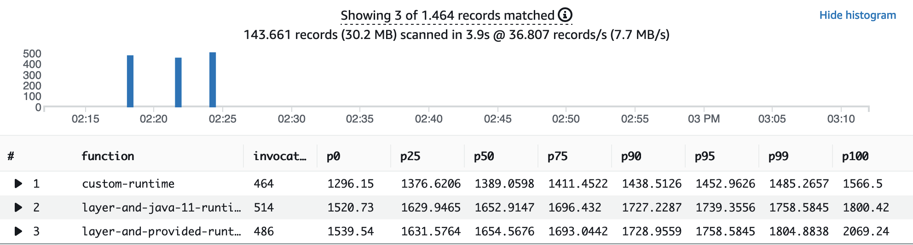
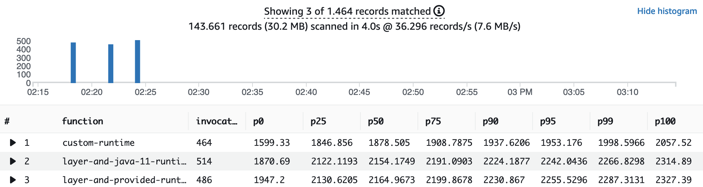
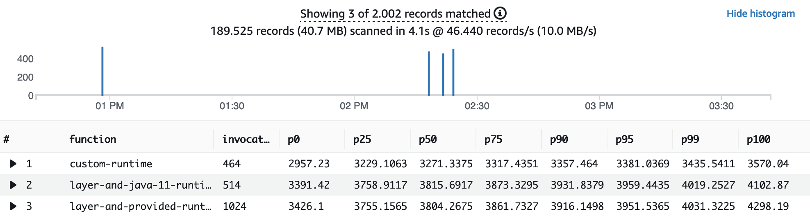
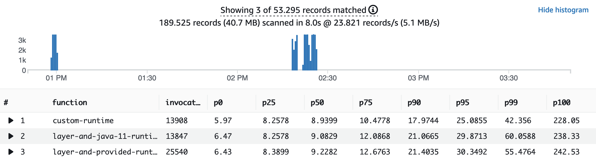

# AWS Lambda function with JRE-17 based layer
An AWS Lambda function based on a generic JRE-17 layer and a custom runtime.


## Getting started

Download or clone the repository.

Install prerequisite software:

1. Install [AWS CDK](https://docs.aws.amazon.com/cdk/latest/guide/getting_started.html)
2. Install [Docker](https://docs.docker.com/get-docker/)

3. Build the AWS Lambda layer using Docker:

```bash
./build-layer.sh
```

4. Build the AWS Lambda custom runtile using Docker:

```bash
./build-custom-runtime.sh
```

5. Build the function and provision the AWS infrastructure (mainly Amazon API Gateway, AWS Lambda and Amazon DynamoDB) using AWS CDK:

```bash
./provision-function.sh
```

The API Gateway endpoint URL is displayed in the output and saved in the file `example/infrastructure/target/outputs.json`. The contents are similar to:

```
{
  "InfrastructureJRE17LayerStack": {
    "apiendpoint": "https://<API_ID>.execute-api.<AWS_REGION>.amazonaws.com"
  }
}
```


## Using Artillery to load test the changes

First, install prerequisites:

1. Install [jq](https://stedolan.github.io/jq/) and [Artillery Core](https://artillery.io/docs/guides/getting-started/installing-artillery.html)
2. Run the following two scripts from the projects root directory:

```bash
artillery run -t $(cat infrastructure/target/outputs.json | jq -r '.LambdaLayerVsCustomRuntime.apiendpoint') -v '{ "url": "/layer-provided-runtime" }' infrastructure/loadtest.yml
artillery run -t $(cat infrastructure/target/outputs.json | jq -r '.LambdaLayerVsCustomRuntime.apiendpoint') -v '{ "url": "/layer-custom-runtime" }' infrastructure/loadtest.yml
artillery run -t $(cat infrastructure/target/outputs.json | jq -r '.LambdaLayerVsCustomRuntime.apiendpoint') -v '{ "url": "/custom-runtime" }' infrastructure/loadtest.yml
```


### Check results in Amazon CloudWatch Insights

1. Navigate to Amazon **[CloudWatch Logs Insights](https://console.aws.amazon.com/cloudwatch/home?#logsV2:logs-insights)**.
2. Select the log groups `/aws/lambda/function-with-layer-and-provided-runtime`, `/aws/lambda/function-with-layer-and-java-11-runtime` and `/aws/lambda/function-with-custom-runtime` from the drop-down list


To see the performance distribution of all cold starts, copy the following query and choose **Run query**:

```
filter @type = "REPORT" and ispresent(@initDuration)
| parse @log /\d+:\/aws\/lambda\/function-with-(?<function>.+)/
| stats
count(*) as invocations,
pct(@initDuration, 0) as p0,
pct(@initDuration, 25) as p25,
pct(@initDuration, 50) as p50,
pct(@initDuration, 75) as p75,
pct(@initDuration, 90) as p90,
pct(@initDuration, 95) as p95,
pct(@initDuration, 99) as p99,
pct(@initDuration, 100) as p100
group by function
| sort by function
```

You see results similar to this:



> Note:  
With the custom-runtime, the fastest cold start is about 200ms - 240ms faster, compared with the layer versions.  
With the custom-runtime, the P99 cold start is about 280ms - 300ms faster, compared with the layer versions.


Now let's take a look at the AWS Lambda function execution (excluding the initialisation time) for all cold starts, for the different versions. Copy the following query and choose **Run query**:

```
filter @type = "REPORT" and ispresent(@initDuration)
| parse @log /\d+:\/aws\/lambda\/function-with-(?<function>.+)/
| stats
count(*) as invocations,
pct(@duration, 0) as p0,
pct(@duration, 25) as p25,
pct(@duration, 50) as p50,
pct(@duration, 75) as p75,
pct(@duration, 90) as p90,
pct(@duration, 95) as p95,
pct(@duration, 99) as p99,
pct(@duration, 100) as p100
group by function
| sort by function
```

You see results similar to this:



> Note:  
With the custom-runtime, the fastest function execution for a cold start is about 270ms - 350ms faster, compared with the layer versions.  
With the custom-runtime, the P99 cold start is about 270ms - 290ms faster, compared with the layer versions.


To evaluate the perceived customer cold start latency, we summarize the init duration and function execution duration. Copy the following query and choose **Run query**:

```
filter @type = "REPORT" and ispresent(@initDuration)
| parse @log /\d+:\/aws\/lambda\/function-with-(?<function>.+)/
| stats
count(*) as invocations,
pct(@duration + @initDuration, 0) as p0,
pct(@duration + @initDuration, 25) as p25,
pct(@duration + @initDuration, 50) as p50,
pct(@duration + @initDuration, 75) as p75,
pct(@duration + @initDuration, 90) as p90,
pct(@duration + @initDuration, 95) as p95,
pct(@duration + @initDuration, 99) as p99,
pct(@duration + @initDuration, 100) as p100
group by function
| sort by function
```

You see results similar to this:



> Note:  
With the custom-runtime, the fastest function initialisation and execution for a cold start is about 430ms - 470ms faster, compared with the layer versions.  
With the custom-runtime, the P99 for the function initialisation and execution for a cold start is about 580ms - 590ms faster, compared with the layer versions.


Last but not least, let's take a look 

```
filter @type = "REPORT" and !ispresent(@initDuration)
| parse @log /\d+:\/aws\/lambda\/function-with-(?<function>.+)/
| stats
count(*) as invocations,
pct(@duration, 0) as p0,
pct(@duration, 25) as p25,
pct(@duration, 50) as p50,
pct(@duration, 75) as p75,
pct(@duration, 90) as p90,
pct(@duration, 95) as p95,
pct(@duration, 99) as p99,
pct(@duration, 100) as p100
group by function
| sort by function
```

You see results similar to this:



> Note:  
With the custom-runtime, the fastest function execution for a warm start is with about 6ms the same, compared with the layer versions.  
With the custom-runtime, the P99 for the function execution for a warm start is about 10ms faster, compared with the layer versions.


## Security

See [CONTRIBUTING](CONTRIBUTING.md#security-issue-notifications) for more information.

## License

This library is licensed under the MIT-0 License. See the LICENSE file.
